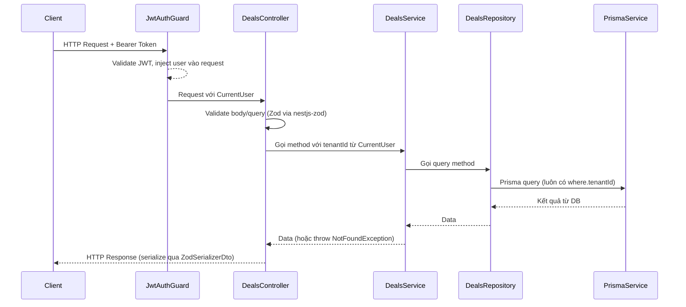
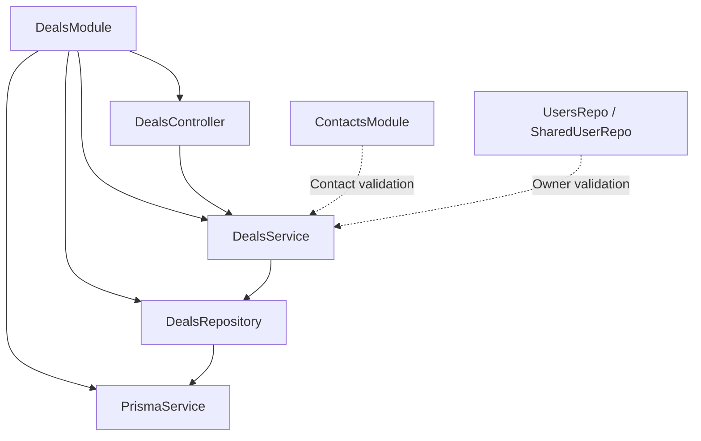

# Thiết kế: Deal Pipeline

## Tổng quan

Module **Deal Pipeline** cung cấp REST API quản lý cơ hội bán hàng (deals) trong hệ thống CRM SaaS multi-tenant. Module cho phép sales team tạo, theo dõi và cập nhật deals theo từng giai đoạn (stage) trên kanban board, đồng thời xem đầy đủ thông tin liên quan gồm contact, tasks, activities và AI suggestions.

Module được xây dựng theo đúng pattern của `contacts` module: `controller → service → repo → model → dto → module`, với multi-tenant isolation bắt buộc qua `tenantId` lấy từ JWT.

### Phạm vi

- CRUD deals (tạo, xem chi tiết, cập nhật thông tin, xóa mềm)
- Xem pipeline dạng kanban (nhóm theo stage)
- Cập nhật stage riêng biệt (dành cho drag-and-drop)
- Multi-tenant isolation hoàn toàn
- Không bao gồm: quản lý tasks, activities, AI suggestions (các module riêng)

---

## Kiến trúc

### Luồng xử lý request



### Cấu trúc module

```
be/src/routes/deals/
├── deals.controller.ts   # HTTP endpoints, guards, serialization
├── deals.service.ts      # Business logic, validation nghiệp vụ
├── deals.repo.ts         # Prisma queries, luôn filter tenantId
├── deals.model.ts        # Zod schemas + TypeScript types
├── deals.dto.ts          # DTO classes (createZodDto wrappers)
└── deals.module.ts       # NestJS module declaration
```

### Vị trí trong hệ thống



---

## Components và Interfaces

### DealsController

Xử lý HTTP routing, authentication guard, input validation và response serialization.

```typescript
@Controller('deals')
@UseGuards(JwtAuthGuard)
export class DealsController {
  // GET /deals/pipeline
  @Get('pipeline')
  @ZodSerializerDto(GetDealsPipelineResDto)
  getPipeline(@CurrentUser() user: AccessTokenPayload)

  // GET /deals/:id
  @Get(':id')
  @ZodSerializerDto(GetDealResDto)
  getDealById(
    @CurrentUser() user: AccessTokenPayload,
    @Param('id') dealId: string,
  )

  // POST /deals
  @Post()
  @ZodSerializerDto(CreateDealResDto)
  createDeal(
    @CurrentUser() user: AccessTokenPayload,
    @Body() body: CreateDealBodyDto,
  )

  // PATCH /deals/:id/stage
  @Patch(':id/stage')
  @ZodSerializerDto(GetDealResDto)
  updateDealStage(
    @CurrentUser() user: AccessTokenPayload,
    @Param('id') dealId: string,
    @Body() body: UpdateDealStageBodyDto,
  )

  // PATCH /deals/:id
  @Patch(':id')
  @ZodSerializerDto(GetDealResDto)
  updateDeal(
    @CurrentUser() user: AccessTokenPayload,
    @Param('id') dealId: string,
    @Body() body: UpdateDealBodyDto,
  )

  // DELETE /deals/:id
  @Delete(':id')
  @ZodSerializerDto(MessageResDto)
  deleteDeal(
    @CurrentUser() user: AccessTokenPayload,
    @Param('id') dealId: string,
  )
}
```

**Lưu ý quan trọng về thứ tự route**: Route `/deals/pipeline` phải được khai báo **trước** `/deals/:id` để NestJS không nhầm `pipeline` là một `:id` param.

### DealsService

Chứa business logic: validate sự tồn tại của contact/owner, xử lý pipeline grouping.

```typescript
@Injectable()
export class DealsService {
  constructor(
    private readonly dealsRepo: DealsRepository,
    private readonly prisma: PrismaService, // dùng để validate contact/owner
  ) {}

  // Lấy pipeline, nhóm deals theo stage
  async getPipeline(tenantId: string);

  // Lấy chi tiết deal kèm relations
  async getDealById(dealId: string, tenantId: string);

  // Tạo deal mới, validate contact + owner trước
  async createDeal(tenantId: string, body: CreateDealBodyType);

  // Cập nhật stage
  async updateDealStage(dealId: string, tenantId: string, stage: DealStage);

  // Cập nhật thông tin deal (partial)
  async updateDeal(dealId: string, tenantId: string, body: UpdateDealBodyType);

  // Soft delete
  async deleteDeal(dealId: string, tenantId: string);
}
```

**Pipeline grouping logic** (trong service, không phải DB):

```typescript
// Khởi tạo object với tất cả 5 stage = [] để đảm bảo luôn có đủ key
const pipeline: GetDealsPipelineResType = {
  PROSPECT: [],
  QUALIFIED: [],
  PROPOSAL: [],
  CLOSED_WON: [],
  CLOSED_LOST: [],
};
deals.forEach((deal) => pipeline[deal.stage].push(deal));
```

### DealsRepository

Thực hiện Prisma queries. **Mọi query đều phải có `where.tenantId`**.

```typescript
@Injectable()
export class DealsRepository {
  constructor(private readonly prisma: PrismaService) {}

  // Lấy tất cả deals active của tenant (dùng cho pipeline)
  findAllByTenant(tenantId: string): Promise<DealWithRelations[]>;

  // Lấy deal theo id + tenantId (kèm full relations)
  findOne(
    dealId: string,
    tenantId: string,
  ): Promise<DealWithFullRelations | null>;

  // Tạo deal mới
  create(tenantId: string, data: CreateDealBodyType): Promise<Deal>;

  // Cập nhật stage
  updateStage(
    dealId: string,
    tenantId: string,
    stage: DealStage,
  ): Promise<Deal>;

  // Cập nhật thông tin (partial)
  update(
    dealId: string,
    tenantId: string,
    data: UpdateDealBodyType,
  ): Promise<Deal>;

  // Soft delete
  softDelete(dealId: string, tenantId: string): Promise<Deal>;
}
```

---

## Data Models

### Prisma Schema (đã có sẵn)

Model `Deal` trong `schema.prisma` đã đầy đủ:

```prisma
model Deal {
  id          String     @id @default(cuid())
  tenantId    String
  contactId   String
  ownerId     String
  title       String
  value       Decimal    @default(0)
  stage       DealStage  @default(PROSPECT)
  closeDate   DateTime?
  note        String?
  createdAt   DateTime   @default(now())
  updatedAt   DateTime   @updatedAt
  deletedAt   DateTime?  // soft delete

  tenant        Tenant          @relation(fields: [tenantId], references: [id])
  contact       Contact         @relation(fields: [contactId], references: [id])
  owner         User            @relation("DealOwner", fields: [ownerId], references: [id])
  tasks         Task[]
  aiSuggestions AiSuggestion[]
  activities    Activity[]

  @@index([tenantId])
  @@index([tenantId, stage])   // tối ưu pipeline query
  @@index([tenantId, ownerId])
}
```

### Zod Schemas (`deals.model.ts`)

```typescript
import { z } from "zod";
import { DealStage } from "generated/prisma-client";

// ─── BASE ───────────────────────────────────────────────────────────────────
const DealBaseSchema = z.object({
  id: z.string(),
  tenantId: z.string(),
  contactId: z.string(),
  ownerId: z.string(),
  title: z.string().min(1).max(200),
  value: z.coerce.number().nonnegative().default(0),
  stage: z.nativeEnum(DealStage),
  closeDate: z.coerce.date().nullable(),
  note: z.string().nullable(),
  createdAt: z.coerce.date(),
  updatedAt: z.coerce.date(),
  deletedAt: z.coerce.date().nullable(),
});

// ─── CREATE ─────────────────────────────────────────────────────────────────
// POST /deals
export const CreateDealBodySchema = z
  .object({
    title: z.string().min(1).max(200),
    contactId: z.string().min(1),
    ownerId: z.string().min(1),
    value: z.number().nonnegative().default(0),
    closeDate: z.coerce.date().optional(),
    note: z.string().optional(),
  })
  .strict();

export const CreateDealResSchema = DealBaseSchema.omit({ deletedAt: true });

export type CreateDealBodyType = z.infer<typeof CreateDealBodySchema>;
export type CreateDealResType = z.infer<typeof CreateDealResSchema>;

// ─── UPDATE STAGE ────────────────────────────────────────────────────────────
// PATCH /deals/:id/stage
export const UpdateDealStageBodySchema = z
  .object({
    stage: z.nativeEnum(DealStage),
  })
  .strict();

export type UpdateDealStageBodyType = z.infer<typeof UpdateDealStageBodySchema>;

// ─── UPDATE DEAL ─────────────────────────────────────────────────────────────
// PATCH /deals/:id
export const UpdateDealBodySchema = z
  .object({
    title: z.string().min(1).max(200).optional(),
    value: z.number().nonnegative().optional(),
    closeDate: z.coerce.date().nullable().optional(),
    note: z.string().nullable().optional(),
  })
  .strict()
  .refine((data) => Object.keys(data).length > 0, {
    message: "Ít nhất phải có một trường được cập nhật",
  });

export type UpdateDealBodyType = z.infer<typeof UpdateDealBodySchema>;

// ─── GET ONE ─────────────────────────────────────────────────────────────────
// GET /deals/:id — full relations
export const GetDealResSchema = DealBaseSchema.omit({ deletedAt: true }).extend(
  {
    contact: z.object({
      id: z.string(),
      name: z.string(),
      email: z.string().nullable(),
      phone: z.string().nullable(),
      company: z.string().nullable(),
      position: z.string().nullable(),
    }),
    owner: z.object({
      id: z.string(),
      name: z.string(),
      email: z.string(),
    }),
    tasks: z.array(
      z.object({
        id: z.string(),
        title: z.string(),
        done: z.boolean(),
        dueDate: z.coerce.date().nullable(),
        createdAt: z.coerce.date(),
      }),
    ),
    activities: z.array(
      z.object({
        id: z.string(),
        type: z.string(),
        title: z.string().nullable(),
        note: z.string(),
        date: z.coerce.date(),
      }),
    ),
    aiSuggestions: z.array(
      z.object({
        id: z.string(),
        type: z.string(),
        content: z.string(),
        createdAt: z.coerce.date(),
      }),
    ),
  },
);

export type GetDealResType = z.infer<typeof GetDealResSchema>;

// ─── PIPELINE ────────────────────────────────────────────────────────────────
// GET /deals/pipeline — card nhỏ, không cần full relations
const DealCardSchema = DealBaseSchema.omit({ deletedAt: true }).extend({
  contact: z.object({ id: z.string(), name: z.string() }),
  owner: z.object({ id: z.string(), name: z.string() }),
});

export const GetDealsPipelineResSchema = z.object({
  PROSPECT: z.array(DealCardSchema),
  QUALIFIED: z.array(DealCardSchema),
  PROPOSAL: z.array(DealCardSchema),
  CLOSED_WON: z.array(DealCardSchema),
  CLOSED_LOST: z.array(DealCardSchema),
});

export type GetDealsPipelineResType = z.infer<typeof GetDealsPipelineResSchema>;
```

### DTOs (`deals.dto.ts`)

```typescript
import { createZodDto } from "nestjs-zod";
import {
  CreateDealBodySchema,
  CreateDealResSchema,
  UpdateDealStageBodySchema,
  UpdateDealBodySchema,
  GetDealResSchema,
  GetDealsPipelineResSchema,
} from "./deals.model";

export class CreateDealBodyDto extends createZodDto(CreateDealBodySchema) {}
export class CreateDealResDto extends createZodDto(CreateDealResSchema) {}
export class UpdateDealStageBodyDto extends createZodDto(
  UpdateDealStageBodySchema,
) {}
export class UpdateDealBodyDto extends createZodDto(UpdateDealBodySchema) {}
export class GetDealResDto extends createZodDto(GetDealResSchema) {}
export class GetDealsPipelineResDto extends createZodDto(
  GetDealsPipelineResSchema,
) {}
```

### Prisma Queries chi tiết (`deals.repo.ts`)

**`findAllByTenant`** — dùng cho pipeline:

```typescript
this.prisma.deal.findMany({
  where: { tenantId, deletedAt: null },
  include: {
    contact: { select: { id: true, name: true } },
    owner: { select: { id: true, name: true } },
  },
  orderBy: { createdAt: "desc" },
});
```

**`findOne`** — full relations cho detail view:

```typescript
this.prisma.deal.findFirst({
  where: { id: dealId, tenantId, deletedAt: null },
  include: {
    contact: true,
    owner: { select: { id: true, name: true, email: true } },
    tasks: { orderBy: { createdAt: "asc" } },
    activities: { orderBy: { date: "desc" }, take: 20 },
    aiSuggestions: { orderBy: { createdAt: "desc" } },
  },
});
```

**`create`**:

```typescript
this.prisma.deal.create({
  data: {
    tenantId,
    contactId: data.contactId,
    ownerId: data.ownerId,
    title: data.title,
    value: data.value ?? 0,
    stage: DealStage.PROSPECT,
    closeDate: data.closeDate ?? null,
    note: data.note ?? null,
  },
});
```

**`updateStage`** — chỉ cập nhật `stage`:

```typescript
this.prisma.deal.update({
  where: { id: dealId, tenantId, deletedAt: null },
  data: { stage },
});
```

**`softDelete`**:

```typescript
this.prisma.deal.update({
  where: { id: dealId, tenantId },
  data: { deletedAt: new Date() },
});
```

---

## Correctness Properties

_A property is a characteristic or behavior that should hold true across all valid executions of a system — essentially, a formal statement about what the system should do. Properties serve as the bridge between human-readable specifications and machine-verifiable correctness guarantees._

### Property 1: Stage mặc định khi tạo deal

_For any_ request tạo deal hợp lệ với `title`, `contactId`, `ownerId` bất kỳ, deal được tạo ra phải có `stage = PROSPECT`.

**Validates: Requirements 1.1**

### Property 2: Validation input tạo deal

_For any_ input tạo deal, nếu `title` là chuỗi rỗng hoặc vượt quá 200 ký tự, hoặc `contactId`/`ownerId` là chuỗi rỗng, hoặc `value` là số âm, thì schema phải reject input đó và không tạo deal.

**Validates: Requirements 1.2, 1.3**

### Property 3: tenantId luôn lấy từ JWT, không từ body

_For any_ request tạo deal, dù body có chứa `tenantId` hay không, deal được tạo ra phải có `tenantId` bằng `tenantId` của user trong JWT token.

**Validates: Requirements 1.4, 7.3**

### Property 4: Pipeline luôn có đủ 5 stage keys

_For any_ tenant với bất kỳ số lượng deals nào (kể cả 0), response của `GET /deals/pipeline` phải là object có đúng 5 key: `PROSPECT`, `QUALIFIED`, `PROPOSAL`, `CLOSED_WON`, `CLOSED_LOST`, mỗi key là một mảng (có thể rỗng).

**Validates: Requirements 2.1, 2.3**

### Property 5: Soft-deleted deals bị loại khỏi mọi query thông thường

_For any_ deal đã bị soft-deleted (`deletedAt != null`), deal đó không được xuất hiện trong kết quả của pipeline query, get-by-id, hay bất kỳ query nào không có điều kiện lọc `deletedAt`.

**Validates: Requirements 2.2, 6.4**

### Property 6: Pipeline card có đủ required fields

_For any_ deal trong pipeline response, mỗi deal card phải chứa đầy đủ các trường: `id`, `title`, `value`, `stage`, `closeDate`, `contact` (gồm `id`, `name`), `owner` (gồm `id`, `name`).

**Validates: Requirements 2.4**

### Property 7: Update stage chỉ thay đổi trường stage

_For any_ deal và bất kỳ `stage` hợp lệ nào, sau khi gọi `PATCH /deals/:id/stage`, tất cả các trường khác của deal (`title`, `value`, `contactId`, `ownerId`, `note`, `closeDate`) phải giữ nguyên giá trị ban đầu.

**Validates: Requirements 3.1, 3.4**

### Property 8: Validation enum DealStage

_For any_ chuỗi không thuộc tập `{PROSPECT, QUALIFIED, PROPOSAL, CLOSED_WON, CLOSED_LOST}`, schema `UpdateDealStageBodySchema` phải reject giá trị đó với lỗi validation.

**Validates: Requirements 3.2**

### Property 9: Partial update hoạt động đúng

_For any_ deal và bất kỳ subset không rỗng nào của `{title, value, closeDate, note}`, sau khi gọi `PATCH /deals/:id` với subset đó, các trường được gửi phải được cập nhật đúng, và các trường không được gửi phải giữ nguyên.

**Validates: Requirements 4.1, 4.2**

### Property 10: Forbidden fields không thể cập nhật qua PATCH /deals/:id

_For any_ request `PATCH /deals/:id` có chứa các trường `tenantId`, `contactId`, `ownerId`, hoặc `stage`, các trường đó phải bị bỏ qua (strict schema reject) và không thay đổi trong DB.

**Validates: Requirements 4.5**

### Property 11: Deal detail có đủ relations và đúng thứ tự sắp xếp

_For any_ deal có `tasks`, `activities`, `aiSuggestions`, response của `GET /deals/:id` phải: (a) chứa đầy đủ `contact`, `owner`, `tasks`, `activities`, `aiSuggestions`; (b) `tasks` sắp xếp theo `createdAt` tăng dần; (c) `activities` sắp xếp theo `date` giảm dần và tối đa 20 bản ghi; (d) không chứa trường `deletedAt`.

**Validates: Requirements 5.1, 5.2, 5.4**

### Property 12: Soft delete loại deal khỏi mọi query thông thường

_For any_ deal tồn tại, sau khi gọi `DELETE /deals/:id`, deal đó phải: (a) không xuất hiện trong pipeline; (b) trả về 404 khi gọi `GET /deals/:id`; (c) vẫn còn trong DB (không bị xóa thật).

**Validates: Requirements 6.1, 6.2, 6.4**

### Property 13: Cross-tenant isolation — trả về 404 thay vì 403

_For any_ deal thuộc tenant A, khi user của tenant B cố truy cập deal đó qua bất kỳ endpoint nào (`GET`, `PATCH`, `DELETE`), response phải là HTTP 404 (không phải 403 hay 200).

**Validates: Requirements 7.4**

---

## Xử lý lỗi

### Bảng mã lỗi

| Tình huống                              | HTTP Status | Message                                           |
| --------------------------------------- | ----------- | ------------------------------------------------- |
| Token thiếu hoặc không hợp lệ           | 401         | Unauthorized                                      |
| Deal không tồn tại hoặc đã bị xóa       | 404         | Deal không tồn tại                                |
| Contact không tồn tại trong tenant      | 404         | Contact không tồn tại                             |
| Owner (user) không tồn tại trong tenant | 404         | User không tồn tại                                |
| Deal thuộc tenant khác                  | 404         | Deal không tồn tại (không lộ thông tin)           |
| Stage không hợp lệ                      | 400         | Zod validation error với danh sách giá trị hợp lệ |
| Body rỗng khi PATCH /deals/:id          | 400         | Ít nhất phải có một trường được cập nhật          |
| title rỗng hoặc > 200 ký tự             | 400         | Zod validation error                              |
| value âm                                | 400         | Zod validation error                              |

### Chiến lược xử lý lỗi

- **Validation lỗi**: nestjs-zod tự động bắt và trả về 400 với chi tiết lỗi từ Zod
- **Not found**: Service throw `NotFoundException` từ `@nestjs/common`
- **Tenant isolation**: Dùng 404 thay vì 403 để không lộ sự tồn tại của resource (security by obscurity)
- **Lỗi DB**: PrismaService propagate lên, HttpExceptionFilter bắt và trả về 500

---

## Chiến lược kiểm thử

### Dual Testing Approach

Module sử dụng cả unit tests và property-based tests để đảm bảo coverage toàn diện:

- **Unit tests**: Kiểm tra các ví dụ cụ thể, edge cases, error conditions
- **Property tests**: Kiểm tra các invariants áp dụng cho mọi input hợp lệ

### Unit Tests

Tập trung vào:

- **Integration tests** cho từng endpoint (dùng NestJS testing module + in-memory DB hoặc mock PrismaService)
- **Edge cases**: body rỗng, deal không tồn tại, token thiếu
- **Error conditions**: 401, 404, 400 với các input cụ thể

Ví dụ test cases:

```
- POST /deals với body hợp lệ → 201 + deal với stage PROSPECT
- POST /deals với title rỗng → 400
- GET /deals/pipeline với tenant không có deal → 5 key đều là []
- DELETE /deals/:id → 200, sau đó GET /deals/:id → 404
- PATCH /deals/:id/stage với stage không hợp lệ → 400
- GET /deals/:id không có token → 401
```

### Property-Based Tests

Thư viện: **fast-check** (TypeScript/JavaScript)

Cấu hình: tối thiểu **100 iterations** mỗi property test.

Mỗi property test phải có comment tag theo format:

```
// Feature: deal-pipeline, Property {N}: {property_text}
```

Mapping property → test:

| Property | Test description                        | Pattern               |
| -------- | --------------------------------------- | --------------------- |
| P1       | Stage mặc định = PROSPECT               | Invariant             |
| P2       | Input validation reject invalid inputs  | Error Conditions      |
| P3       | tenantId từ JWT                         | Round-trip / Security |
| P4       | Pipeline luôn có 5 keys                 | Invariant             |
| P5       | Soft-deleted deals bị loại              | Invariant             |
| P6       | Pipeline card fields đầy đủ             | Invariant             |
| P7       | Update stage không thay đổi fields khác | Metamorphic           |
| P8       | Enum validation                         | Error Conditions      |
| P9       | Partial update đúng                     | Round-trip            |
| P10      | Forbidden fields bị reject              | Error Conditions      |
| P11      | Deal detail relations + sort order      | Invariant             |
| P12      | Soft delete round-trip                  | Round-trip            |
| P13      | Cross-tenant → 404                      | Security / Invariant  |

Ví dụ property test với fast-check:

```typescript
import fc from "fast-check";

// Feature: deal-pipeline, Property 1: Stage mặc định khi tạo deal
it("deal mới luôn có stage = PROSPECT", async () => {
  await fc.assert(
    fc.asyncProperty(
      fc.record({
        title: fc.string({ minLength: 1, maxLength: 200 }),
        contactId: fc.string({ minLength: 1 }),
        ownerId: fc.string({ minLength: 1 }),
        value: fc.float({ min: 0 }),
      }),
      async (body) => {
        const deal = await dealsService.createDeal(tenantId, body);
        expect(deal.stage).toBe(DealStage.PROSPECT);
      },
    ),
    { numRuns: 100 },
  );
});

// Feature: deal-pipeline, Property 4: Pipeline luôn có đủ 5 stage keys
it("pipeline luôn có đủ 5 stage keys", async () => {
  await fc.assert(
    fc.asyncProperty(
      fc.array(
        fc.record({ stage: fc.constantFrom(...Object.values(DealStage)) }),
      ),
      async (deals) => {
        // seed deals vào DB
        const pipeline = await dealsService.getPipeline(tenantId);
        const keys = Object.keys(pipeline);
        expect(keys).toHaveLength(5);
        expect(keys).toEqual(expect.arrayContaining(Object.values(DealStage)));
      },
    ),
    { numRuns: 100 },
  );
});
```
